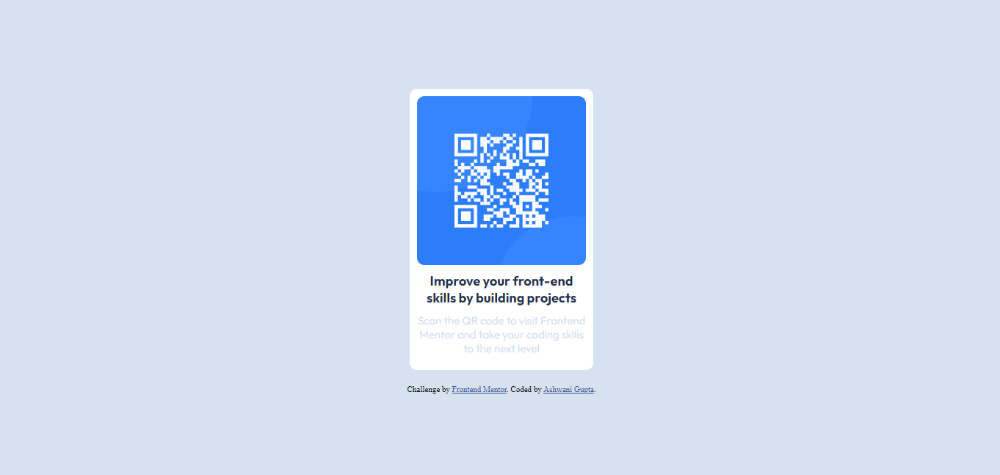

# Frontend Mentor - QR code component solution

This is a solution to the [QR code component challenge on Frontend Mentor](https://www.frontendmentor.io/challenges/qr-code-component-iux_sIO_H). Frontend Mentor challenges help you improve your coding skills by building realistic projects. 

## Table of contents

- [Overview](#overview)
  - [Screenshot](#screenshot)
  - [Links](#links)
- [My process](#my-process)
  - [Built with](#built-with)
- [Author](#author)

## Overview
A Frontend Mentor project to replicate a given design of a QR code graphic with only CSS and HTML.
### Screenshot

### Links

- Solution URL: [Solution]()
- Live Site URL: [Live Site](https://ashdev0.github.io/QR-code-component/)

## My process
This was a simple introduction to image and flexbox formatting. Some simple semantic markup was used as well to organize the HTML in a more readable way.

### Built with

- Semantic HTML5 markup
- CSS
- Flexbox

## Author

- Website - [My Portfolio](https://github.com/AshDev0/QR-code-component.git)
- Frontend Mentor - [@AshDev0](https://www.frontendmentor.io/profile/AshDev0)